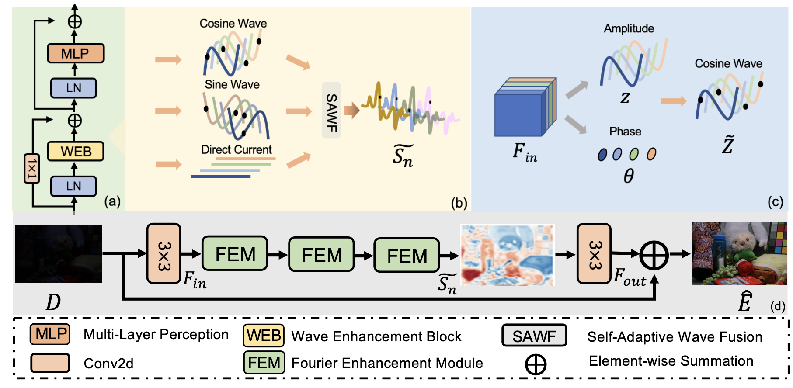
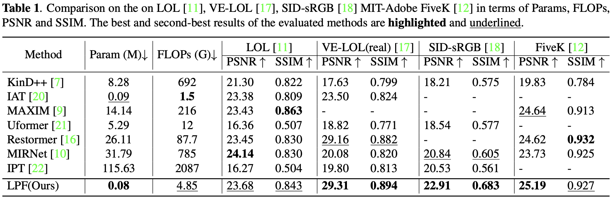
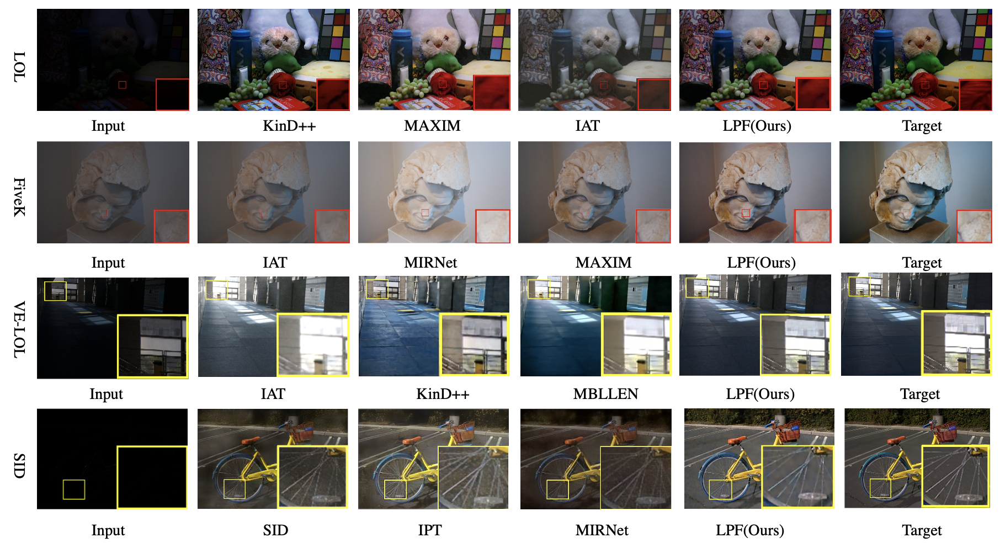

# [ICIP 2023] [You Only Need 80K Parameters to Enhance Image: Learning Periodic Features for Image Enhancement](https://ieeexplore.ieee.org/abstract/document/10222843/)  

## [Jiachen Dang](https://github.com/DenijsonC), Yong Zhong, [Lishun Wang](https://github.com/ucaswangls)   
[](https://ieeexplore.ieee.org/abstract/document/10222843/) 

> Abstract : Benefiting from the promising performance of CNNs models for high-level vision tasks, these networks have been extensively adopted to image enhancement tasks. However, recent methods have complex architecture resulting in poor generalization and high computational cost. Their activation functions are originally designed for other vision tasks. In this work, we present a lightweight network to learn periodic features (LPF) using the proposed wave presentation. Specifically, to better capture implicit feature representations, we represent features as signals with three parts: Cosine Wave Map (CWM), Sine Wave Map (SWM) and Direct Current Map (DCM). Thus, we formulate the image enhancement task as a signal modulation problem. Inspired by the Fourier transform, we build the Fourier Enhancement Module (FEM) that allows for efficient and scalable spatial mixing of local and non-local contents and dynamically learns the interaction between waves to enhance the images. LPF with only 80k parameters achieves better quantitative and qualitative results compared with SOTA methods on four image enhancement datasets.

## Network Architecture  
<table>
  <tr>
    <td colspan="2"> </td>  
  </tr>
  <tr>
    <td colspan="2"><p align="center"><b>Overall pipeline of LPF</b></p></td>
  </tr>
</table>

## Quick Run  

Test on local environment:  

To test the pre-trained models of enhancing on your own images, run
```
python demo.py --input_dir images_folder_path --result_dir save_images_here --weights path_to_models
```
**All pre-trained models can be found at the folder "checkpoints/$<$dataset$>$"

## Train  
The train code will be released soon! 
But you can train our model by writing a simple training script.
  
- Dataset:  
  The preparation of dataset in more detail, see [datasets/README.md](datasets/README.md).  

## Test (Evaluation)  
 
- To test the PSNR, SSIM and LPIPS of *image enhancement*, see [evaluation.py](./evaluation.py) and run
```
python evaluation.py -dirA images_folder_path -dirB images_folder_path -type image_data_type --use_gpu use_gpu_or_not
```

## Result  
- Evaluation on LOL/FiveK/VE-LOL/SID datasets.  
  

## Visual Comparison
  


## Citation  

```
@INPROCEEDINGS{10222843,
  author={Dang, Jia-chen and Zhong, Yong and Wang, Li-shun},
  booktitle={2023 IEEE International Conference on Image Processing (ICIP)}, 
  title={You Only Need 80k Parameters to Enhance Image: Learning Periodic Features for Image Enhancement}, 
  year={2023},
  volume={},
  number={},
  pages={885-889},
  doi={10.1109/ICIP49359.2023.10222843}}  
```
## Contact
Should you have any question, please contact dj.chen112@gmail.com


**Acknowledgment:** This code is based on the [MIRNet](https://github.com/swz30/MIRNet). 
